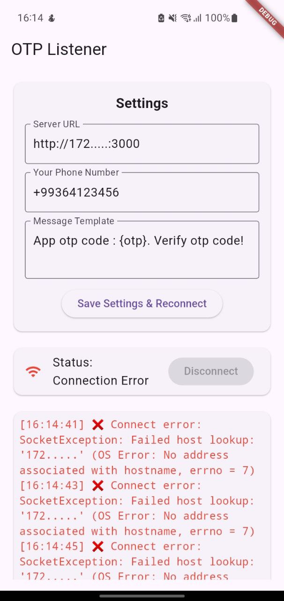
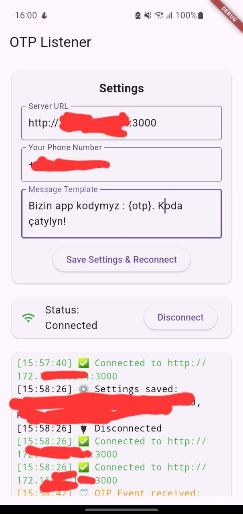

# 📲 OTP Listener Flutter App

A **Flutter application** that connects to a WebSocket server, listens for OTP events, and automatically sends SMS messages. Fully configurable with dynamic message templates, server URL, and recipient phone number.

---

## 🌟 Features

- **WebSocket Listener:** Connects to a `socket.io` server and listens for OTP events.
- **Automatic SMS Sending:** Sends OTPs automatically via SMS using the [another_telephony](https://pub.dev/packages/another_telephony) plugin.
- **Dynamic Message Template:** Customize your SMS template using `{otp}` placeholder.
- **Configurable Settings:** Update server URL, phone number, and message template from the app.
- **Persistent Settings:** Settings are saved using `SharedPreferences` and persist across app restarts.
- **Real-time Logs:** Monitor connection and SMS events directly in the app.

---

## 📷 Screenshots

<p align="center">
  
  &nbsp;&nbsp;
  
</p>


## 🚀 Getting Started

### Prerequisites

- Flutter 3.x or newer
- Android device (SMS sending works on real devices)
- Internet connection for WebSocket
- Permissions for SMS (`SEND_SMS`)

---

### Installation

1. Clone the repository:

```bash
git clone https://github.com/northernwolf00/sms-sender.git
cd sms-sender
````

2. Install dependencies:

```bash
flutter pub get
```

3. Connect your Android device or start an emulator.

4. Run the app:

```bash
flutter run
```

---

## ⚙️ Configuration

**Settings Available in App:**

1. **Server URL:**
   The WebSocket server to connect to. Example:
   `http://172......:3000`

2. **Phone Number:**
   The number to receive OTPs. Example:
   `+99365654321`

3. **Message Template:**
   Customize the message sent via SMS. Use `{otp}` as a placeholder for the OTP code.
   Example:

   ```
   App otp code : {otp}. Verify otp code!
   ```

> The app automatically prepends `+993` if missing from the server-provided number.

---

## 📝 Usage

1. Open the app on your Android device.
2. Go to **Settings** and configure the server URL, phone number, and message template.
3. Tap **Save Settings & Reconnect**.
4. The app connects to the WebSocket server and listens for OTP events.
5. When an OTP event is received, the app automatically sends an SMS to the configured phone number using the defined template.
6. All events are logged in the **Logs** section for easy tracking.

---

## 🔒 Permissions

Make sure the following permissions are added in `AndroidManifest.xml`:

```xml
<uses-permission android:name="android.permission.INTERNET"/>
<uses-permission android:name="android.permission.SEND_SMS"/>
<uses-permission android:name="android.permission.RECEIVE_SMS"/>
```

---

## 📦 Dependencies

* [flutter](https://flutter.dev/)
* [another\_telephony](https://pub.dev/packages/another_telephony) - for sending SMS
* [socket\_io\_client](https://pub.dev/packages/socket_io_client) - for WebSocket communication
* [shared\_preferences](https://pub.dev/packages/shared_preferences) - for saving settings

---

## ⚠️ Notes

* SMS sending works only on **Android devices**.
* The server should send events in **JSON format**:

```json
{
  "phone_number": "63123456",
  "otp": "80878"
}
```

* `{otp}` in the message template is replaced dynamically with the actual OTP.
* Logs display connection status, events, and SMS sending results.

---

## 📝 License

This project is licensed under the **MIT License** - see the [LICENSE](LICENSE) file for details.

```
```
